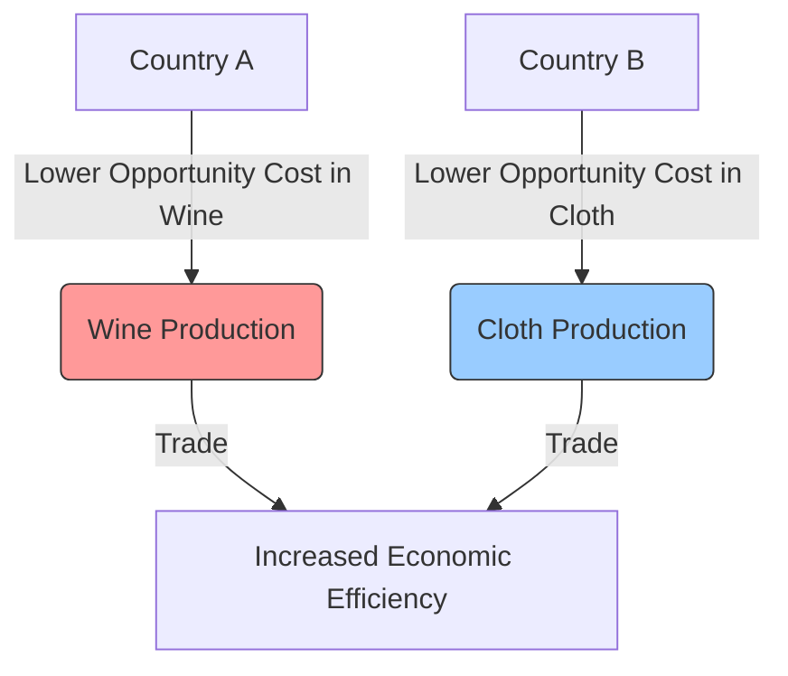

# [Comparative Advantage](https://en.wikipedia.org/wiki/Comparative_advantage)

- The Scottish economist [David Ricardo](https://en.wikipedia.org/wiki/David_Ricardo) had an unusual and non-intuitive insight: Two individuals, firms, or countries could benefit from trading with one another even if one of them was better at everything. 
- Comparative advantage is best seen as an applied opportunity cost: If it has the opportunity to trade, an entity gives up free gains in productivity by not focusing on what it does best.

!!! example "Example of Comparative Advantage"
    Country A has a comparative advantage in producing wine over Country B, as it can produce wine at a lower opportunity cost, allowing both countries to benefit from trade.