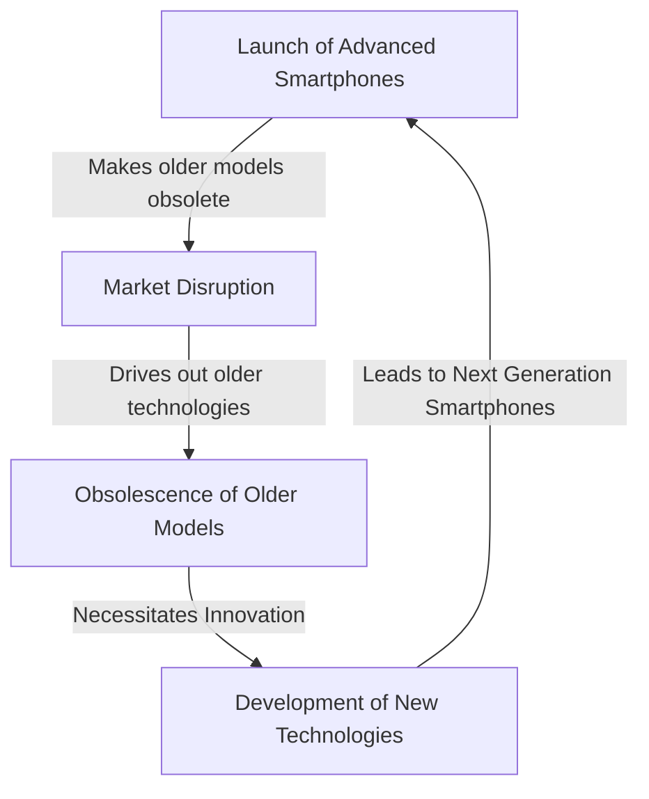

# [Creative Destruction](https://en.wikipedia.org/wiki/Creative_destruction)

- Coined by economist [Joseph Schumpeter](https://en.wikipedia.org/wiki/Joseph_Schumpeter), the term “creative destruction” describes the capitalistic process at work in a functioning free-market system. 
- Motivated by personal incentives (including but not limited to financial profit), entrepreneurs will push to best one another in a never-ending game of creative one-upmanship, in the process destroying old ideas and replacing them with newer technology. 
- Beware getting left behind.

!!! example "Example of Creative Destruction"
    the smartphone industry, where the introduction of new and advanced smartphones constantly replaces older models and technologies, rendering them obsolete and driving innovation in the market.