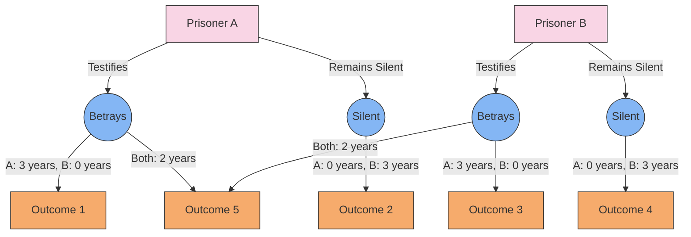

# [Prisoner's Dilemma](https://en.wikipedia.org/wiki/Prisoner%27s_dilemma) 

- The Prisoner’s Dilemma is a famous application of [game theory](https://en.wikipedia.org/wiki/Game_theory) in which two prisoners are both better off cooperating with each other, but if one of them cheats, the other is better off cheating. Thus the dilemma. 

- This model shows up in economic life, in war, and in many other areas of practical human life. Though the prisoner’s dilemma theoretically leads to a poor result, in the real world, cooperation is nearly always possible and must be explored.

!!! example "Example of Prisoner's Dilemma"
    Two criminals are arrested, but the police lack sufficient evidence for a conviction; the police separate the prisoners and offer each the same deal: if one testifies against the other and the other remains silent, the betrayer goes free while the silent accomplice receives the full sentence.