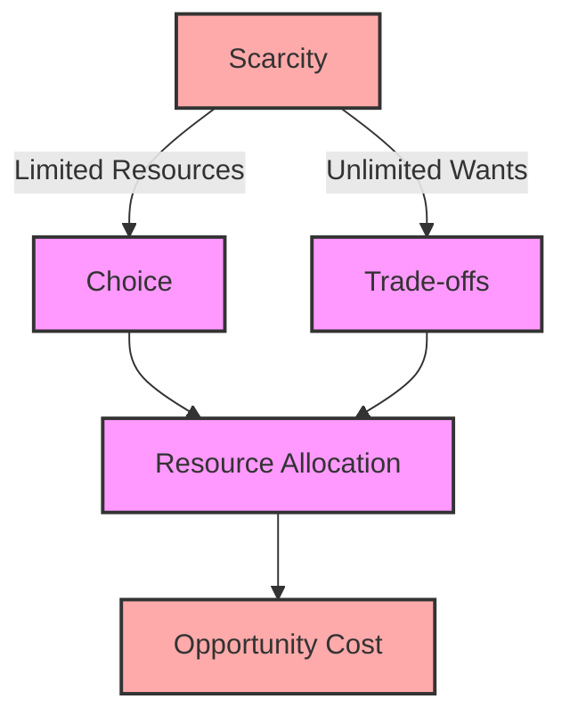

# [Scarcity](https://en.wikipedia.org/wiki/Scarcity)

- [Game theory](https://en.wikipedia.org/wiki/Game_theory) describes situations of conflict, limited resources, and competition. Given a certain situation and a limited amount of resources and time, what decisions are competitors likely to make, and which should they make? 

- One important note is that traditional game theory may describe humans as more rational than they really are. Game theory is theory, after all.

!!! example "Example of Scarcity"
    The scarcity of clean water in the region has led to a severe crisis, forcing communities to ration their usage

