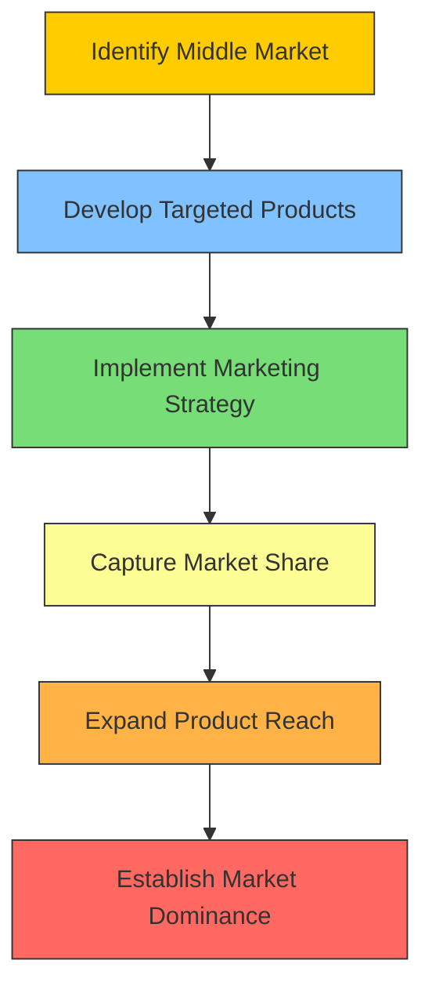

# [Seizing the Middle](https://fs.blog/seizing-the-middle-chess-strategy-in-business/)

- In chess, the winning strategy is usually to seize control of the middle of the board, so as to maximize the potential moves that can be made and control the movement of the maximal number of pieces. 

- The same strategy works profitably in business, as can be demonstrated by [John D. Rockefeller](https://en.wikipedia.org/wiki/John_D._Rockefeller)’s control of the refinery business in the early days of the oil trade and Microsoft’s control of the operating system in the early days of the software trade.

!!! example "Example of Seizing the Middle"
    in the fiercely competitive smartphone market, [Honor](https://en.wikipedia.org/wiki/Honor_(brand))'s brand achieved success by seizing the middle segment, offering features that appealed to both high-end and budget-conscious consumers.
