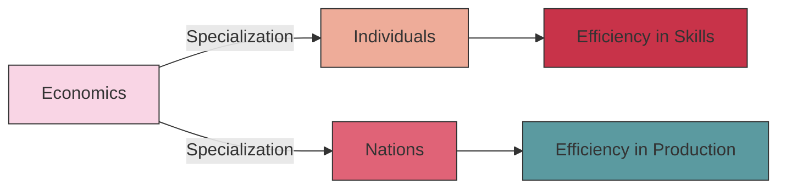

# [Specialization](https://www.investopedia.com/terms/s/specialization.asp)

- Scottish economist, [Adam Smith](https://en.wikipedia.org/wiki/Adam_Smith), highlighted the advantages gained in a free-market system by specialization. 

- Rather than having a group of workers each producing an entire item from start to finish, Smith explained that it’s usually far more productive to have each of them specialize in one aspect of production. 

- He also cautioned, however, that each worker might not enjoy such a life; this is a trade-off of the specialization model.

!!! example "Example of Specialization"
    A Pin Factory exemplifies the principle of specialization by dedicating its entire production process to the creation of high-quality pins, ensuring it's the top dog within this specific manufacturing sector.