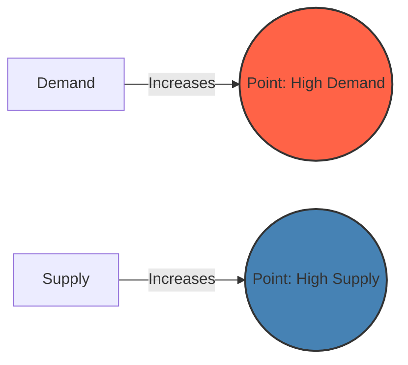

# [Supply and Demand](https://en.wikipedia.org/wiki/Supply_and_demand)

- The basic equation of biological and economic life is one of limited supply of necessary goods and competition for those goods. 

- Just as biological entities compete for limited usable energy, so too do economic entities compete for limited customer wealth and limited demand for their products. 

- The point at which supply and demand for a given good are equal is called an [equilibrium](https://en.wikipedia.org/wiki/Mechanical_equilibrium); however, in practical life, equilibrium points tend to be dynamic and changing, never static.

!!! example "Example of Supply and Demand"
    As the demand for electric cars increased significantly, manufacturers ramped up their supply, leading to a more competitive and dynamic market.

