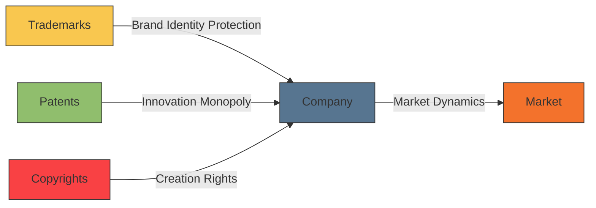

# [Trademarks, Patents and Copyrights](https://en.wikipedia.org/wiki/Trademark)

- These three concepts, along with other related ones, protect the creative work produced by enterprising individuals, thus creating additional incentives for creativity and promoting the creative-destruction model of capitalism. 

- Without these protections, information and creative workers have no defense against their work being freely distributed.

!!! example "Example of Trademarks, Patents and Copyrights"
    Intellectual properties enable companies to establish a unique market position, create barriers to entry for competitors, and open up various revenue streams through exclusive rights, licensing, and legal protection. (See [Patent Troll](https://en.wikipedia.org/wiki/Patent_troll)).