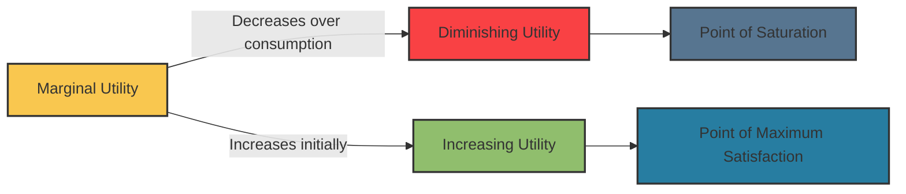

# [Marginal, Diminishing, Increasing Utilities](https://www.investopedia.com/terms/u/utility.asp)

- The usefulness of additional units of any good tends to vary with scale. Marginal utility allows us to understand the value of one additional unit, and in most practical areas of life, that utility diminishes at some point. 

- On the other hand, in some cases, additional units are subject to a “critical point” where the utility function jumps discretely up or down. 

!!! example "Example of Diminishing Marginal Utility"
    Giving water to a thirsty man has diminishing marginal utility with each additional unit, and can eventually kill him with enough units.
