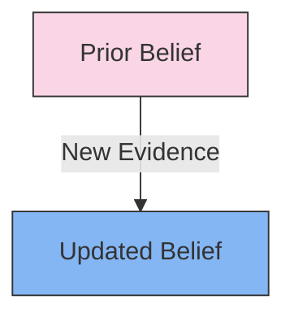

# [Bayesian Updating](https://en.wikipedia.org/wiki/Bayes%27_theorem)

- The Bayesian method is a method of thought (named for Thomas Bayes) whereby one takes into account all prior relevant probabilities and then incrementally updates them as newer information arrives. 

- This method is especially productive given the fundamentally non-deterministic world we experience: We must use prior odds and new information in combination to arrive at our best decisions. 

- This is not necessarily our intuitive decision-making engine.

!!! example "Example of Bayesian Updating"
    After observing more patients recovering quickly when given a new medication, the doctor used Bayesian updating to increase her belief in the effectiveness of the treatment.