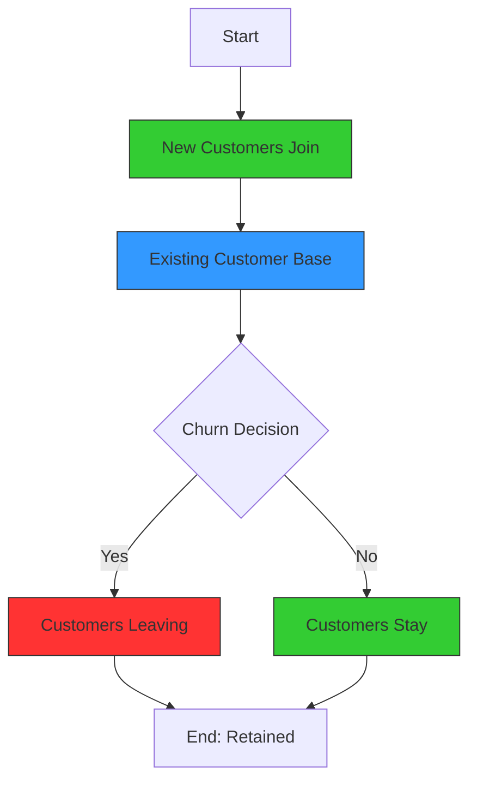

# [Churn](https://en.wikipedia.org/wiki/Churn_rate)

- Insurance companies and subscription services are well aware of the concept of churn – every year, a certain number of customers are lost and must be replaced. 

- Standing still is the equivalent of losing, as seen in the model called the “[Red Queen Effect](https://en.wikipedia.org/wiki/Red_Queen_hypothesis)” Churn is present in many business and human systems: A constant figure is periodically lost and must be replaced before any new figures are added over the top.

!!! example "Example of Churn"
    The telecom company experienced a high customer churn rate last quarter, indicating that many customers were switching to competitors.