# [Compounding](https://wiki.treasurers.org/wiki/Compounding_effect)

```mermaid
graph LR;
    A[$1,000] -->|Year 1: 5% Interest| B[$1,050]
    B -->|Year 2: 5% Interest| C[$1,102.50]
    C -->|Year 3: 5% Interest| D[$1,157.63]
    D -->|Year 4: 5% Interest| E[$1,215.51]
    E -->|Year 5: 5% Interest| F[$1,276.28]

    style A fill:#f0f8ff,stroke:#333
    style B fill:#e6e6fa,stroke:#333
    style C fill:#d8bfd8,stroke:#333
    style D fill:#dda0dd,stroke:#333
    style E fill:#ee82ee,stroke:#333
    style F fill:#ff00ff,stroke:#333
```

- It’s been said that [Einstein](https://en.wikipedia.org/wiki/Albert_Einstein) called compounding a wonder of the world. He probably didn’t, but it is a wonder. 

- Compounding is the process by which we add interest to a fixed sum, which then earns interest on the previous sum and the newly added interest, and then earns interest on that amount, and so on [ad infinitum](https://en.wikipedia.org/wiki/Ad_infinitum). 

- It is an exponential effect, rather than a linear, or additive, effect. Money is not the only thing that compounds; ideas and relationships do as well. 

- In tangible realms, compounding is always subject to physical limits and diminishing returns; intangibles can compound more freely. 

- Compounding also leads to the time value of money, which underlies all of modern finance.

!!! example "Example of Compounding"
    A savings account compounds annually, meaning each year the interest is calculated not just on the original amount deposited, but also on the accumulated interest from previous years.

