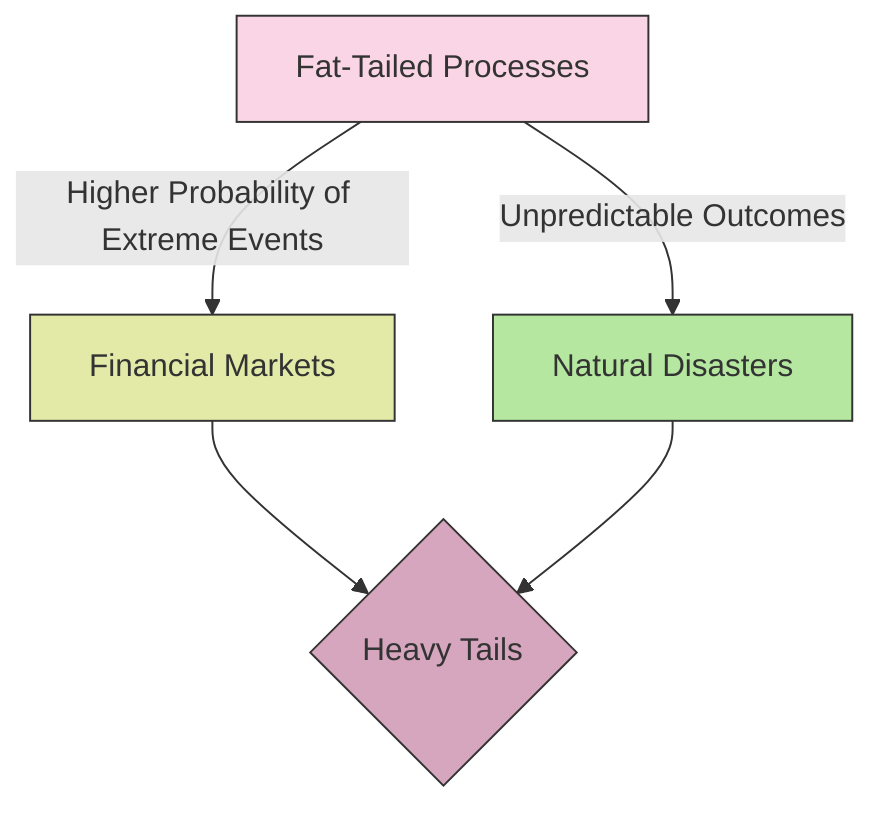

# [Fat Tailed Processes](https://en.wikipedia.org/wiki/Fat-tailed_distribution#:~:text=The%20class%20of%20fat%2Dtailed,such%20as%20the%20log%2Dnormal.)

- A process can often look like a normal distribution but have a large “tail” – meaning that seemingly outlier events are far more likely than they are in an actual normal distribution. 

- A strategy or process may be far more risky than a normal distribution is capable of describing if the fat tail is on the negative side, or far more profitable if the fat tail is on the positive side. Much of the human social world is said to be fat-tailed rather than normally distributed.

!!! example "Example of Fat Tailed Processes"
    In financial markets, price movements often exhibit fat-tailed processes, where extreme changes are more common than predicted by a normal distribution.
