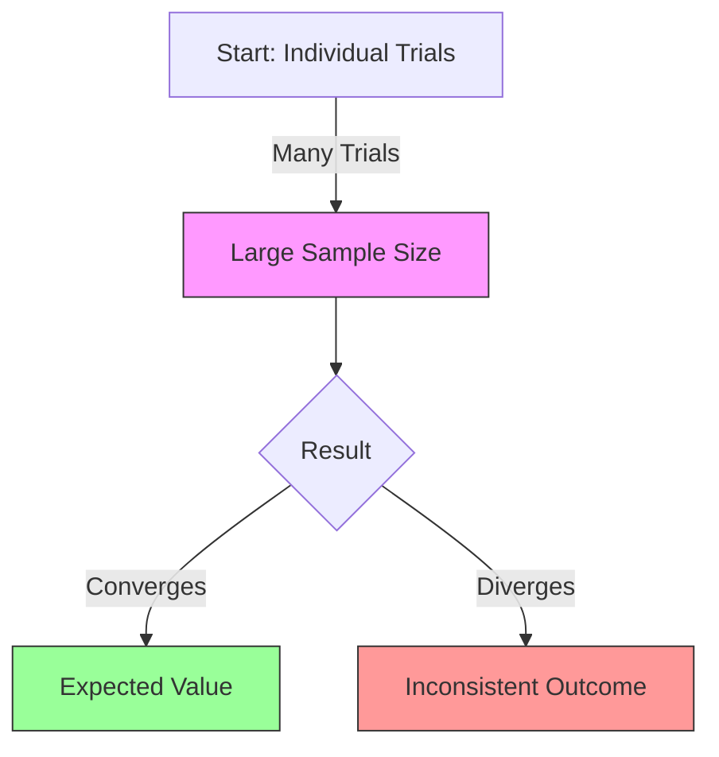

# [Law of Large Numbers](https://en.wikipedia.org/wiki/Law_of_large_numbers)

- One of the fundamental underlying assumptions of probability is that as more instances of an event occur, the actual results will converge on the expected ones. 

!!! example "Example of Law of Large Numbers"
    If I know that the average man is 5 feet 10 inches tall, I am far more likely to get an average of 5′10″ by selecting 500 men at random than 5 men at random. The opposite of this model is the law of small numbers, which states that small samples can and should be looked at with great skepticism.
