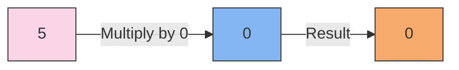

- Any reasonably educated person knows that any number multiplied by zero, no matter how large the number, is still zero. 

- This is true in human systems as well as mathematical ones. In some systems, a failure in one area can negate great effort in all other areas. 

- As simple multiplication would show, fixing the “zero” often has a much greater effect than does trying to enlarge the other areas.

!!! example "Example of Multiplying by Zero"
    When you multiply any number by zero, the result is always zero. For instance, 5 multiplied by 0 equals 0.

