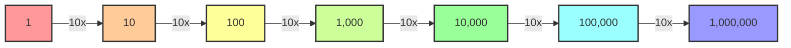

# [Order of Magnitude](https://en.wikipedia.org/wiki/Orders_of_magnitude_(numbers))

- In many, perhaps most, systems, quantitative description down to a precise figure is either impossible or useless (or both). 

!!! example "Example of Order of Magnitude"
    Estimating the distance between our galaxy and the next one over is a matter of knowing not the precise number of miles, but how many zeroes are after the 1. Is the distance about 1 million miles or about 1 billion? This thought habit can help us escape useless precision.

