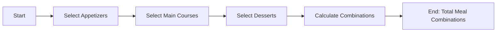

# [Permutations](https://en.wikipedia.org/wiki/Permutation) and [Combinations](https://en.wikipedia.org/wiki/Combination)

- The mathematics of permutations and combinations leads us to understand the practical probabilities of the world around us, how things can be ordered, and how we should think about things.

!!! example "Example of Permutations and Combinations"
    When planning a dinner menu, you have a list of appetizers, main courses, and desserts to choose from. By using permutations and combinations, you can determine how many different meal combinations you can create, which helps you plan a diverse and satisfying menu for your in-laws.