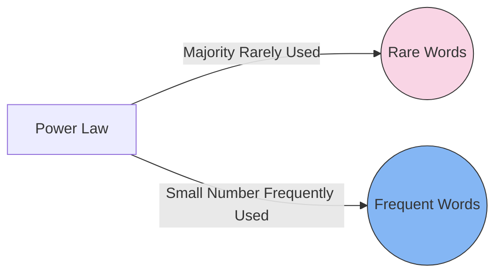

# [Power Law](https://en.wikipedia.org/wiki/Power_law)

- One of the most common processes that does not fit the normal distribution is that of a power law, whereby one quantity varies with another’s exponent rather than linearly. 

!!! example "Example of Power Laws"
    the [Richter scale](https://en.wikipedia.org/wiki/Richter_scale) describes the power of earthquakes on a power-law distribution scale: an 8 is 10x more destructive than a 7, and a 9 is 10x more destructive than an 8. The central limit theorem does not apply and there is thus no “average” earthquake. This is true of all power-law distributions.
