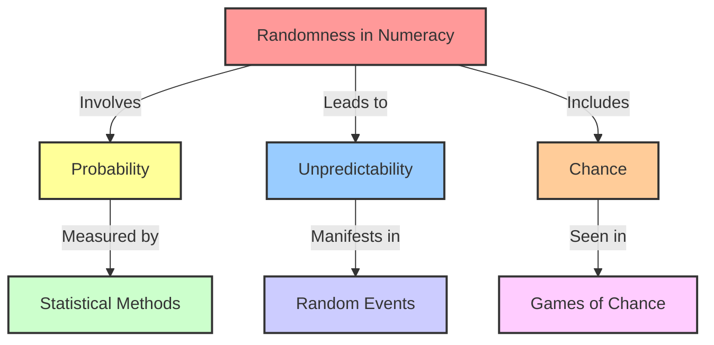

# [Randomness](https://en.wikipedia.org/wiki/Randomness)

- Though the human brain has trouble comprehending it, much of the world is composed of random, non-sequential, non-ordered events. 

- We are “fooled” by random effects when we attribute causality to things that are actually outside of our control. 

- If we don’t course-correct for this fooled-by-randomness effect – our faulty sense of pattern-seeking – we will tend to see things as being more predictable than they are and act accordingly.

!!! example "Example of Randomness"
    Shuffling a deck of cards, theoretically in a perfect world when a deck is shuffled, the order of the cards is randomized. This means that each card has an equal probability of being placed in any position within the deck.
