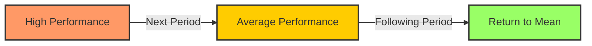

# [Regression to the Mean](https://en.wikipedia.org/wiki/Regression_toward_the_mean)

- In a normally distributed system, long deviations from the average will tend to return to that average with an increasing number of observations: the so-called Law of Large Numbers. 

- We are often fooled by regression to the mean, as with a sick patient improving spontaneously around the same time they begin taking an herbal remedy, or a poorly performing sports team going on a winning streak. 

- We must be careful not to confuse statistically likely events with causal ones.

!!! example "Example of Regression to the Mean"
    After an unusually high sales quarter, the company's performance in the next quarter was more in line with its average, illustrating a classic case of regression to the mean.
