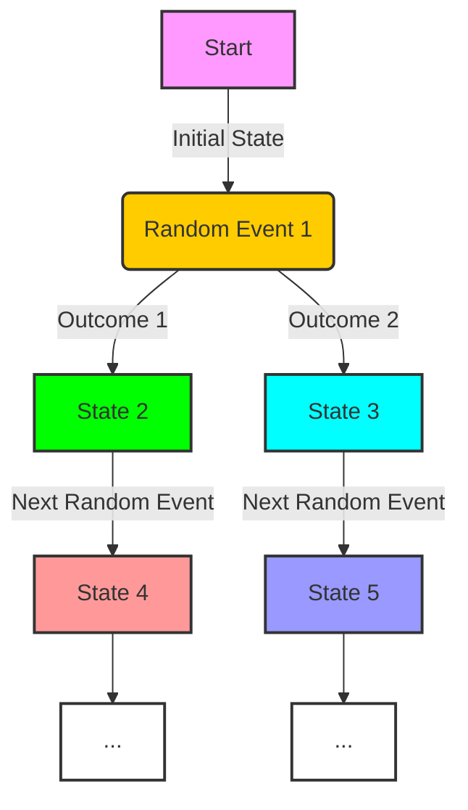

# [Stochastic Processes](https://en.wikipedia.org/wiki/Stochastic_process)

- A stochastic process is a random statistical process and encompasses a wide variety of processes in which the movement of an individual variable can be impossible to predict but can be thought through probabilistically. 

- The wide variety of stochastic methods helps us describe systems of variables through probabilities without necessarily being able to determine the position of any individual variable over time. 

!!! example "Example of Stochastic Processes"
    It’s not possible to predict stock prices on a day-to-day basis, but we can describe the probability of various distributions of their movements over time. Obviously, it is much more likely that the stock market (a stochastic process) will be up or down 1% in a day than up or down 10%, even though we can’t predict what tomorrow will bring.
