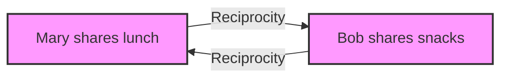

Reciprocity 
- If I push on a wall, physics tells me that the wall pushes back with equivalent force. 
- In a biological system, if one individual acts on another, the action will tend to be reciprocated in kind. 
- Human beings act with intense reciprocity demonstrated as well.

!!! example "Example of Reciprocity"
    When Mary shares her lunch with her friend Bob at school, Bob reciprocates by sharing his snacks with Mary the next day.

Draw a flowchart illustrating the example, provide mermaid code