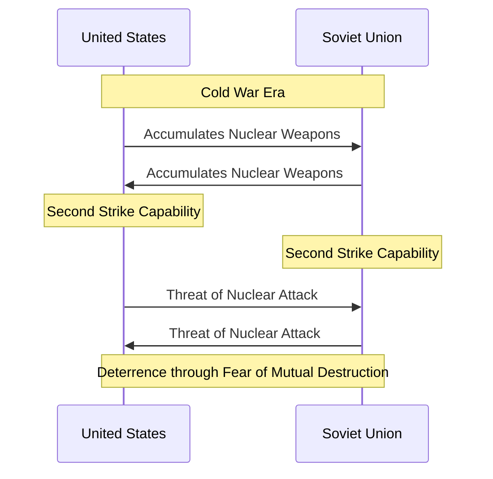

# [Mutually Assured Destruction]()

- Paradoxically, the stronger two opponents become, the less likely they may be to destroy one another. 
- This process of mutually assured destruction occurs not just in warfare, as with the development of global nuclear warheads, but also in business, as with the avoidance of destructive price wars between competitors. 
- In a fat-tailed world, it is also possible that mutually assured destruction scenarios simply make destruction more severe in the event of a mistake (pushing destruction into the “tails” of the distribution).

!!! example "Example of Mutually Assured Destruction"
    [Cold War](https://en.wikipedia.org/wiki/Cold_War) standoff between the United States and the Soviet Union, where both sides possessed enough nuclear weapons to guarantee total annihilation if either initiated a nuclear attack.