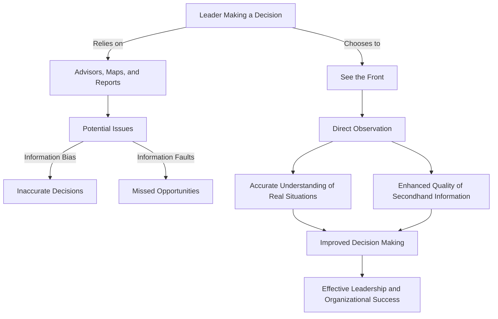

# [Seeing the Front](https://en.wikipedia.org/wiki/Front_(military))

- Personally seeing the front before making decisions is incredibly valuable. 
- Always relying on advisors, maps, and reports can lead to information being faulty or biased. 
- The Map/Territory model illustrates the problem with not seeing the front, as does the incentive model. 
- Leaders of any organization can generally benefit from seeing the front, as not only does it provide firsthand information, but it also tends to improve the quality of secondhand information.

!!! example "Example of Seeing The Front"
    A CEO visits their company's manufacturing plants to directly observe operations, thereby gaining a more accurate understanding of the workflow and challenges than what might be presented in reports or meetings.