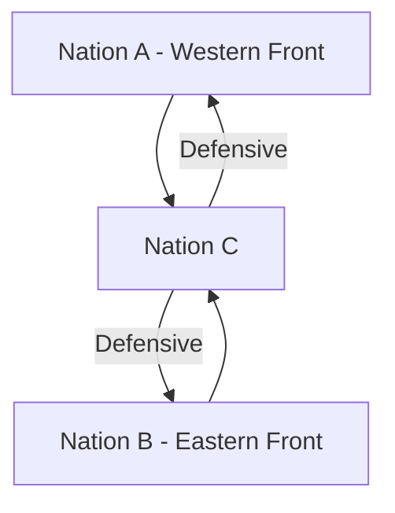

# [Two Front War](https://en.wikipedia.org/wiki/Two-front_war)

- The Second World War was a good example of a two-front war. 
- Once Russia and Germany became enemies, Germany was forced to split its troops and send them to separate fronts, weakening their impact on either front. 
- In real life, opening a two-front war can often be a useful tactic, as can solving a two-front war or avoiding one, as in the example of an organization tamping down internal discord to focus on its competitors.

!!! example "Example of a Two Front War"
    The [Second World War](https://en.wikipedia.org/wiki/World_War_II), where Germany fought against the Allies in Western Europe and against the Soviet Union in Eastern Europe, is a classic example of a two-front war.
