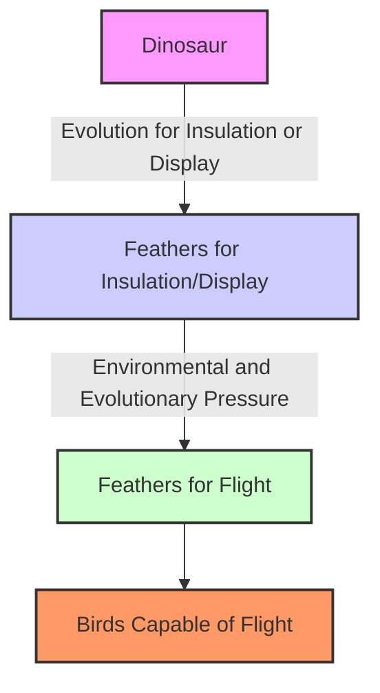

# [Exaptation](https://en.wikipedia.org/wiki/Exaptation)

- Introduced by the biologist [Steven Jay Gould](https://en.wikipedia.org/wiki/Stephen_Jay_Gould), an exaptation refers to a trait developed for one purpose that is later used for another purpose. 
- It's a process in evolutionary biology where a trait evolves for one purpose but is later adapted for a different use.

!!! example "Example of Exaptation"
    The development of complex biological features like an eyeball; in a more primitive form, it may have been used for something else. Once it was there, and once it developed further, 3D sight became possible.
