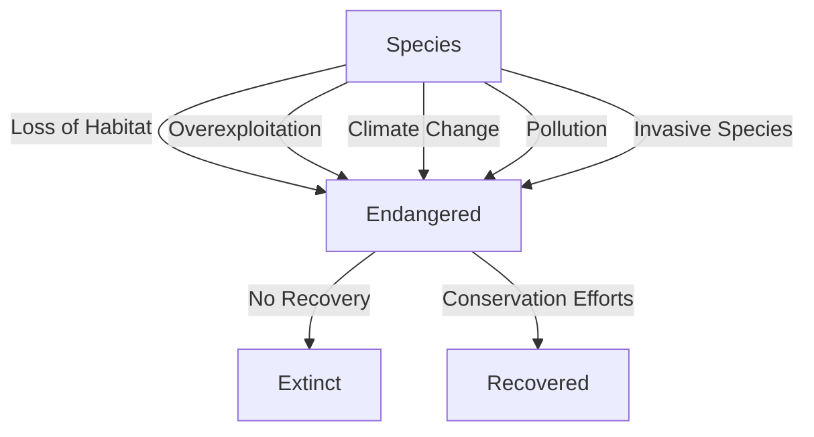

# [Extinction](https://en.wikipedia.org/wiki/Extinction)

- The inability to survive can cause an extinction event, whereby an entire species ceases to compete and replicate effectively. 
- Once its numbers have dwindled to a critically low level, an extinction can be unavoidable (and predictable) given the inability to effectively replicate in large enough numbers.

!!! example "Example of Extinction"
    The [dodo bird](https://en.wikipedia.org/wiki/Dodo), once native to Mauritius, is a well-known example of biological extinction, having become extinct in the 17th century due to human activities and introduced species.

