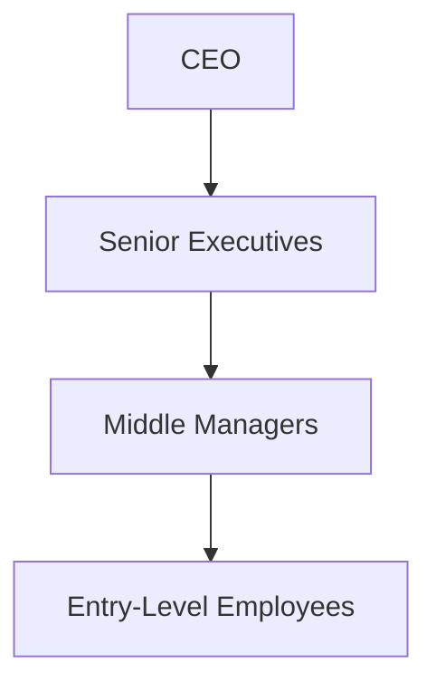

# [Hierarchy](https://en.wikipedia.org/wiki/Hierarchy)

- Most complex biological organisms have an innate feel for how they should organize. 
- While not all organic systems end up with hierarchical structures, many do, especially in the animal kingdom. 
- Human beings like to think they are outside of this, but they feel the hierarchical instinct as strongly as any other organism.

!!! example "Example of Hierarchy"
    In a company, the CEO is at the top of the hierarchy, followed by senior executives, middle managers, and then entry-level employees.