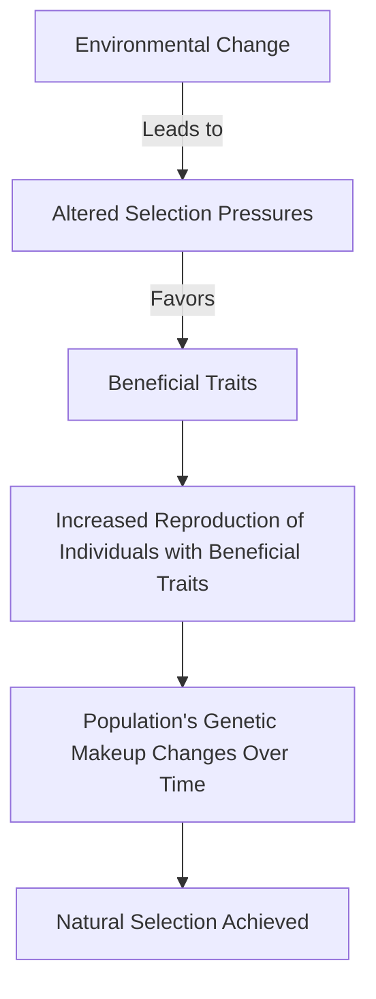

# [Natural Selection](https://en.wikipedia.org/wiki/Natural_selection)

- Evolution by natural selection was once called “the greatest idea anyone ever had.” In the 19th century, Charles Darwin and Alfred Russel Wallace simultaneous realized that species evolve through random mutation and differential survival rates. 
- If we call human intervention in animal-breeding an example of “artificial selection,” we can call Mother Nature deciding the success or failure of a particular mutation “natural selection.” 
- Those best suited for survival tend to be preserved. But of course, conditions change.

!!! example "Example of Natural Selection"
    [Peppered moths](https://askabiologist.asu.edu/peppered-moths-game/natural-selection.html) in industrial areas evolved darker wings to better camouflage against pollution-darkened trees, enhancing their survival.