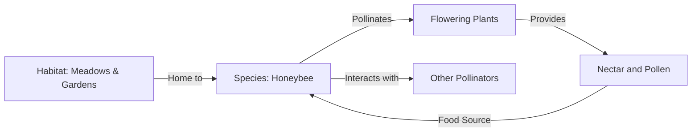

# [Niches](https://en.wikipedia.org/wiki/Ecological_niche)

- Most organisms find a niche: a method of competing and behaving for survival. 
- A species will select a niche for which it is best adapted. 
- The danger arises when multiple species begin competing for the same niche, which can cause an extinction – there can be only so many species doing the same thing before limited resources give out.

!!! example "Example of Niches"
    the role of honeybees as pollinators in many ecosystems is incredibly niche, where they facilitate the reproduction of flowering plants.