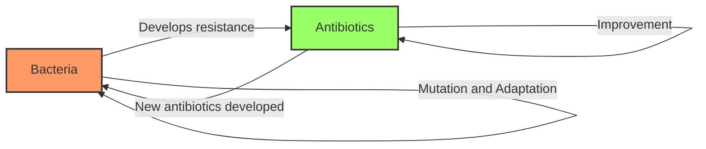

# [Red Queen Effect](https://en.wikipedia.org/wiki/Red_Queen_hypothesis)

- The evolution by [natural selection](https://mkchong.com/Knowledge/Models/Biological/naturalSelection/) model leads to something of an arms race among species competing for limited resources. 
- When one species evolves an advantageous adaptation, a competing species must respond in kind or fail as a species, becoming complacent can mean falling behind. 
- This arms race is called the Red Queen Effect for the character in Alice in Wonderland who said, “Now, here, you see, it takes all the running you can do, to keep in the same place.”

!!! example "Example of the Red Queen Effect"
    The arms race between bacteria developing [antibiotic resistance](https://en.wikipedia.org/wiki/Antimicrobial_resistance) and the creation of new antibiotics to combat them.