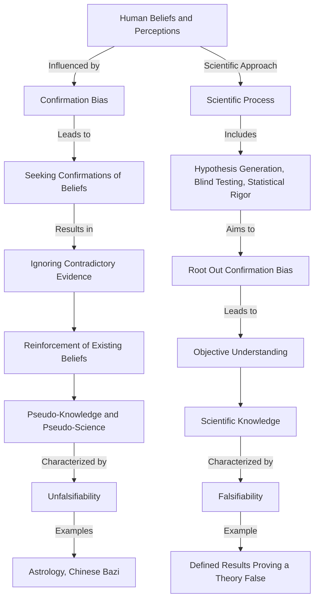

# [Confirmation Bias](https://en.wikipedia.org/wiki/Confirmation_bias#:~:text=Confirmation%20bias%20is%20the%20tendency,one's%20prior%20beliefs%20or%20values.)

- What a human wishes, they want to believe. Therefore, what we believe is what we choose to see. This is commonly referred to as the confirmation bias. 
- It is a deeply ingrained mental habit, both energy-conserving and comfortable, to look for confirmations of long-held wisdom rather than violations. 
- The Scientific process – including hypothesis generation, blind testing when needed, and objective statistical rigor – is designed to root out precisely the opposite, which is why it works so well when followed.
- The modern world operates under the principle of falsification: A method is termed scientific if it can be stated in such a way that a certain defined result would cause it to be proved false. 
- Pseudo-knowledge and pseudo-science operate and propagate by being unfalsifiable – as with [astrology](https://en.wikipedia.org/wiki/Horoscope), [Chinese Bazi](https://en.wikipedia.org/wiki/Four_Pillars_of_Destiny) etc. we are unable to prove them either correct or incorrect because the conditions under which they would be shown false are never stated.

!!! Example "Example of Conformation Bias"
    In a political debate, friends with preexisting biases selectively interpreted information to support their preferred candidates, illustrating confirmation bias by ignoring opposing perspectives.