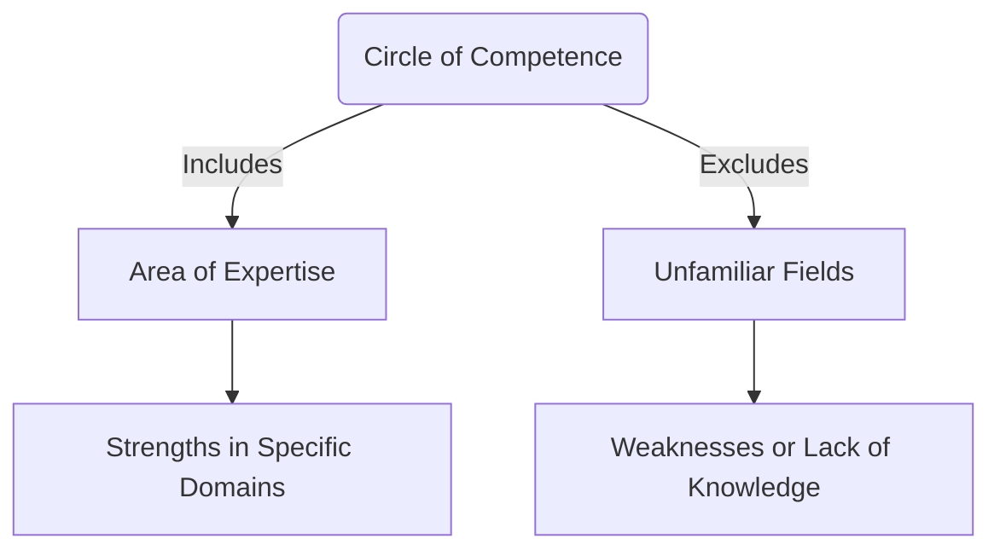

# [Circle of Competence](https://en.wikipedia.org/wiki/Circle_of_competence)

- An idea introduced by [Warren Buffett](https://en.wikipedia.org/wiki/Warren_Buffett) and [Charles Munger](https://en.wikipedia.org/wiki/Charlie_Munger) in relation to investing: each individual tends to have an area or areas in which they really, truly know their stuff, their area of special competence. 
- Areas not inside that circle are problematic because not only are we ignorant about them, but we may also be ignorant of our own ignorance. Thus, when we're making decisions, it becomes important to define and attend to our special circle, so as to act accordingly.

!!! example "Example of Circle of Competence"
    A chef specializing in Italian cuisine demonstrates their circle of competence by excelling in making traditional Italian dishes while avoiding attempts at unfamiliar Japanese sushi preparation.
