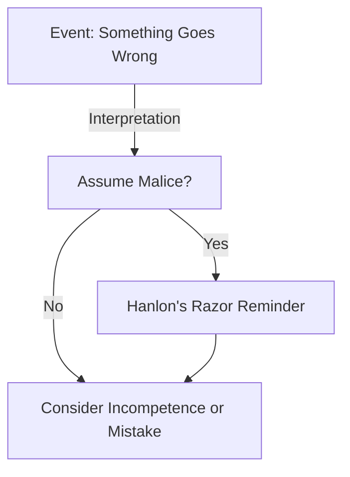

# [Hanlon's Razor](https://en.wikipedia.org/wiki/Hanlon%27s_razor)

- Harder to trace in its origin, Hanlon’s Razor states that we should not attribute to malice that which is more easily explained by stupidity. 
- In a complex world, this principle helps us avoid extreme paranoia and ideology, often very hard to escape from, by not generally assuming that bad results are the fault of a bad actor, although they can be (More likely, a mistake has been made).

!!! example "Example of Hanlon's Razor"
    A colleague accidentally deleting an important file, not out of malice, but because they were unfamiliar with the computer system, exemplifies Hanlon's Razor.