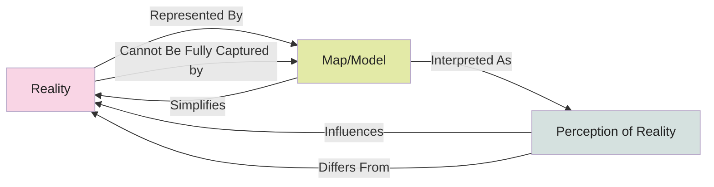

# [The Map Is Not The Territory](https://en.wikipedia.org/wiki/Map%E2%80%93territory_relation#%22A_map_is_not_the_territory%22)

- The map of reality is not reality itself. 
- If any map were to represent its actual territory with perfect fidelity, it would be the size of the territory itself. 
- No need for a map! This model tells us that there will always be an imperfect relationship between reality and the models we use to represent and understand it. 
- This imperfection is a necessity in order to simplify. It is all we can do to accept this and act accordingly.

!!! example "Example of The Map Is Not The Territory"
    A nutritional label summarizing the complex chemical composition of a food item. It represents the food's nutritional aspects but cannot capture its complete chemical complexity or the experience of its taste and texture.