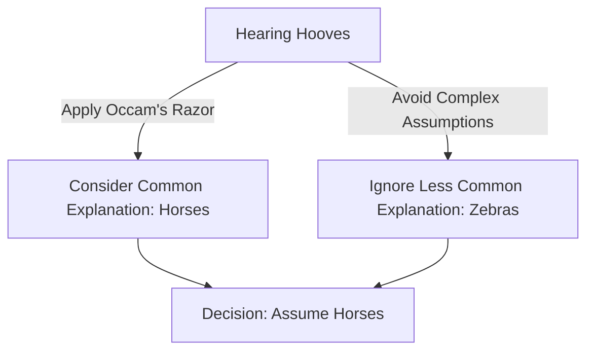

# [Occam's Razor](https://en.wikipedia.org/wiki/Occam%27s_razor)

- Named after the friar [William of Ockham](https://en.wikipedia.org/wiki/William_of_Ockham), Occam’s Razor is a heuristic by which we select among competing explanations. 
- Ockham stated that we should prefer the simplest explanation with the least moving parts: it is easier to [falsify](https://en.wiktionary.org/wiki/falsification), easier to understand, and more likely, on average, to be correct. 
- This principle is not an iron law but a tendency and a mindset: If all else is equal, it’s more likely that the simple solution suffices. 
- We also keep in mind [Einstein](https://en.wikipedia.org/wiki/Albert_Einstein)’s famous idea (even if apocryphal) that “an idea should be made as simple as possible, but no simpler.”

!!! example "Example of Occam's Razor"
    When hearing hooves, think horses, not zebras (assuming you are in a region where horses are common and zebras are not).

