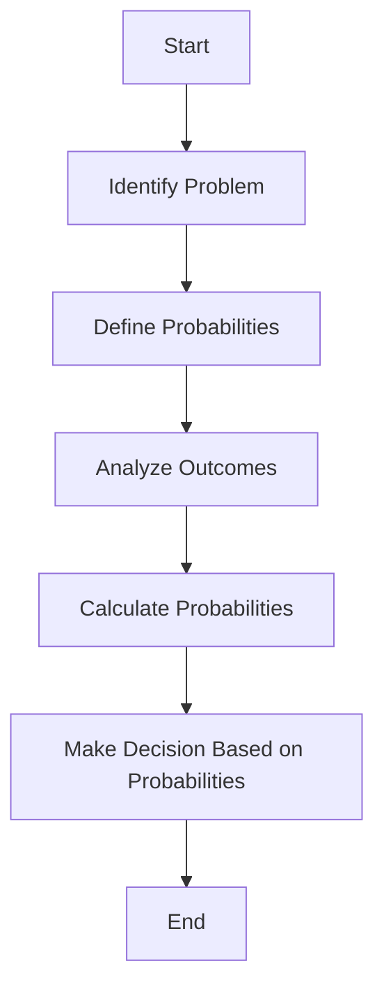

# [Probabilistic Thinking](https://en.wikipedia.org/wiki/Probability_theory)

- The unknowable human world is dominated by probabilistic outcomes, as distinguished from [deterministic](https://en.wikipedia.org/wiki/Determinism) ones. 
- Although we cannot predict the future with great certainty, we are wise to ascribe odds to more and less probable events. 
- We do this every day unconsciously as we cross the street and ascribe low, yet not negligible, odds of being hit by a car.

!!! example "Example of Probabilistic Thinking"
    Deciding to bring an umbrella based on a 60% weather forecast of rain is an example of probabilistic thinking