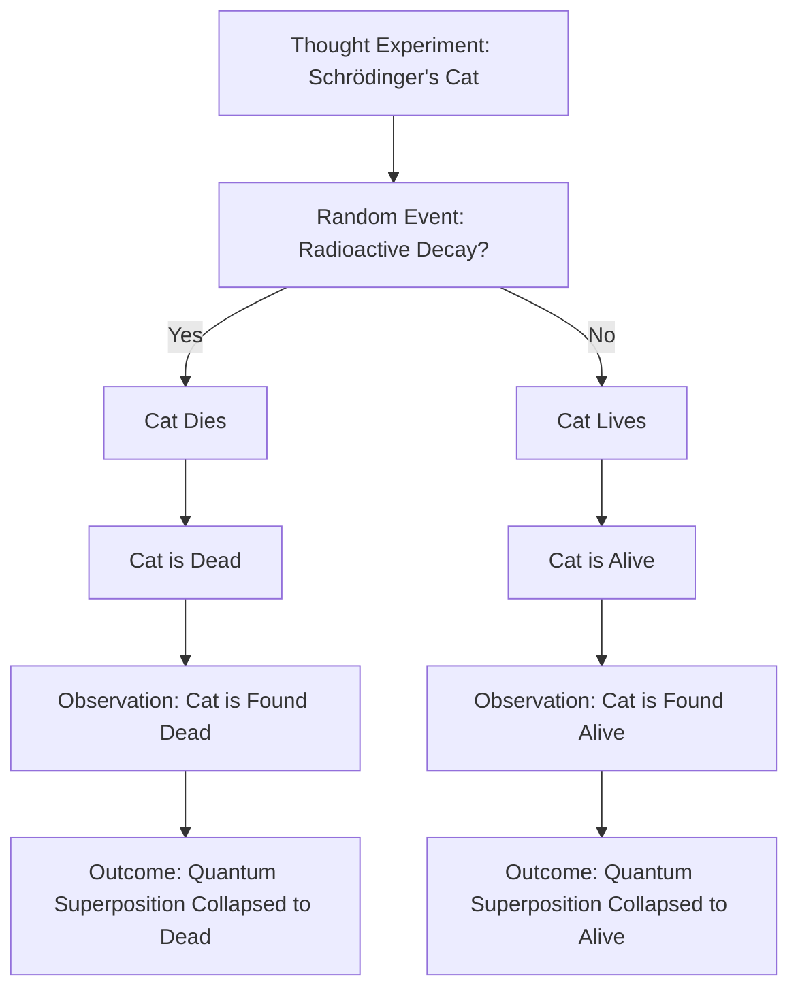

# [Thought Experiment](https://en.wikipedia.org/wiki/Thought_experiment)

- A technique popularized by [Einstein](https://en.wikipedia.org/wiki/Albert_Einstein), the thought experiment is a way to logically carry out a test in one’s own head that would be very difficult or impossible to perform in real life. 
- With the thought experiment as a tool, we can solve problems with intuition and logic that could not be demonstrated physically, as with Einstein imagining himself traveling on a beam of light in order to solve the problem of relativity.

!!! example "Example of Thought Experiment"
    [Schrödinger's Cat](https://en.wikipedia.org/wiki/Schr%C3%B6dinger%27s_cat), which illustrates the [paradox](https://en.wikipedia.org/wiki/Paradox) of [quantum superposition](https://en.wikipedia.org/wiki/Quantum_superposition) by imagining a cat that may be simultaneously alive and dead, depending on an earlier random event.