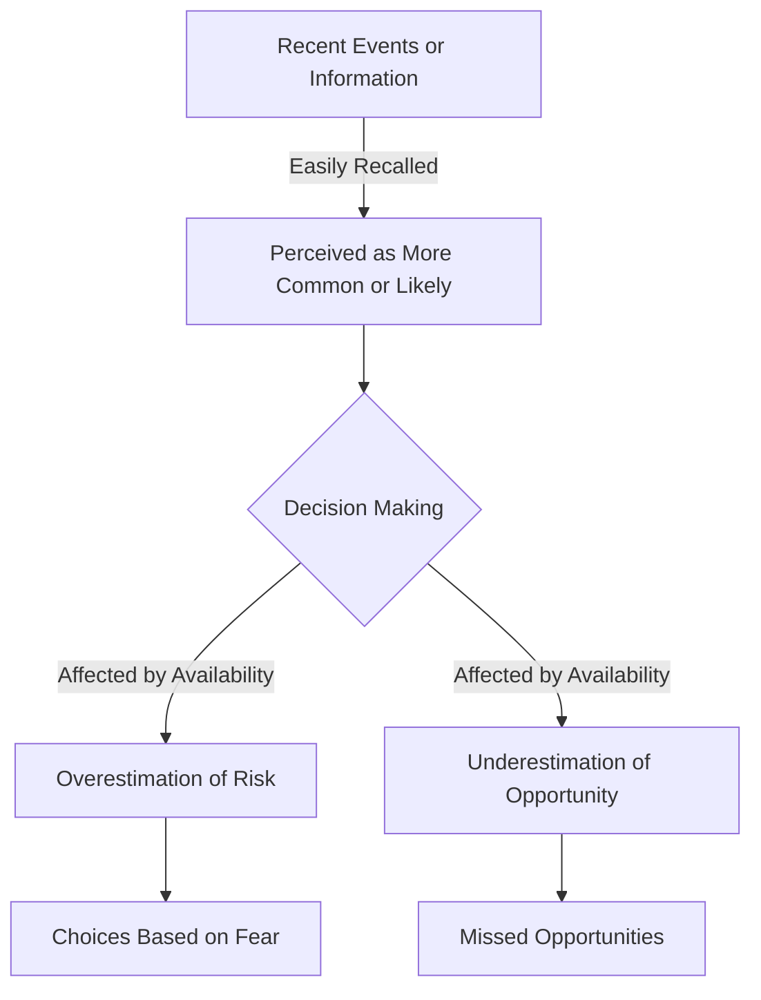

# [Availability Heuristic](https://en.wikipedia.org/wiki/Availability_heuristic)

- One of the most useful findings of modern psychology is what Daniel Kahneman calls the Availability Bias or Heuristic: We tend to most easily recall what is salient, important, frequent, and recent. 
- The brain has its own energy-saving and inertial tendencies that we have little control over – the availability heuristic is likely one of them. 
- Having a truly comprehensive memory would be debilitating. Some sub-examples of the availability heuristic include the Anchoring and [Sunk Cost](https://en.wikipedia.org/wiki/Sunk_cost) Tendencies.

!!! example "Example of Availability Heuristic" 
    After reading several news articles about airplane accidents, John began to believe that air travel was extremely dangerous, a classic case of the availability heuristic affecting his perception of risk.