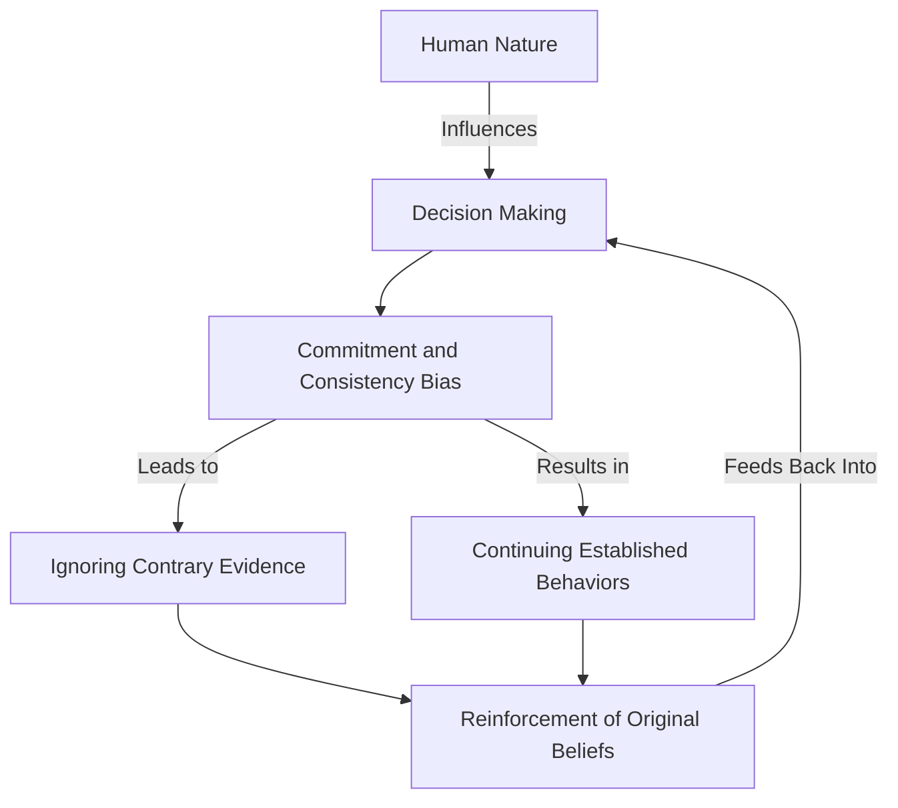

# [Commitment and Consistency Bias](https://en.wikipedia.org/wiki/Cognitive_bias)

- As psychologists have frequently and famously demonstrated, humans are subject to a [bias](https://en.wikipedia.org/wiki/Bias) towards keeping their prior commitments and staying consistent with our prior selves when possible. 
- This trait is necessary for social cohesion: people who often change their conclusions and habits are often distrusted. 
- Our bias towards staying consistent can become, as one wag put it, a “[hobgoblin](https://en.wikipedia.org/wiki/Hobgoblin) of foolish minds” – when it is combined with the [first-conclusion bias](https://en.wikipedia.org/wiki/Selection_bias), we end up landing on poor answers and standing pat in the face of great evidence.

!!! example "Example of Commitment and Consistency"
    Even after learning about the negative environmental impact of gas vehicles, John continued to advocate for them, showing commitment and consistency bias, as he had spent years passionately defending their use.