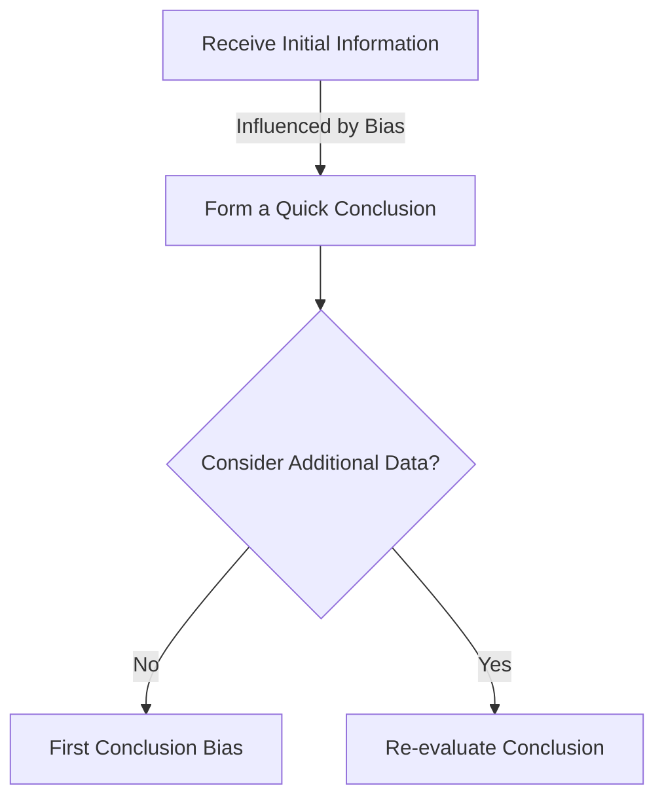

# [First Conclusion Bias](https://www.ncbi.nlm.nih.gov/pmc/articles/PMC3900086/#:~:text=Bias%20is%20any%20trend%20or,which%20can%20cause%20false%20conclusions.)

- [Charlie Munger](https://en.wikipedia.org/wiki/Charlie_Munger) famously pointed out, the mind works a bit like a sperm and egg: the first idea gets in and then the mind shuts. 
- Like many other tendencies, this is probably an energy-saving device. 
- Our tendency to settle on first conclusions leads us to accept many erroneous results and cease asking questions; it can be countered with some simple and useful mental routines.

!!! example "Example of First Conclusion Bias"
    After hearing only a brief summary of the evidence, the jury quickly decided the defendant was guilty, exemplifying first conclusion bias by not considering all possible explanations.