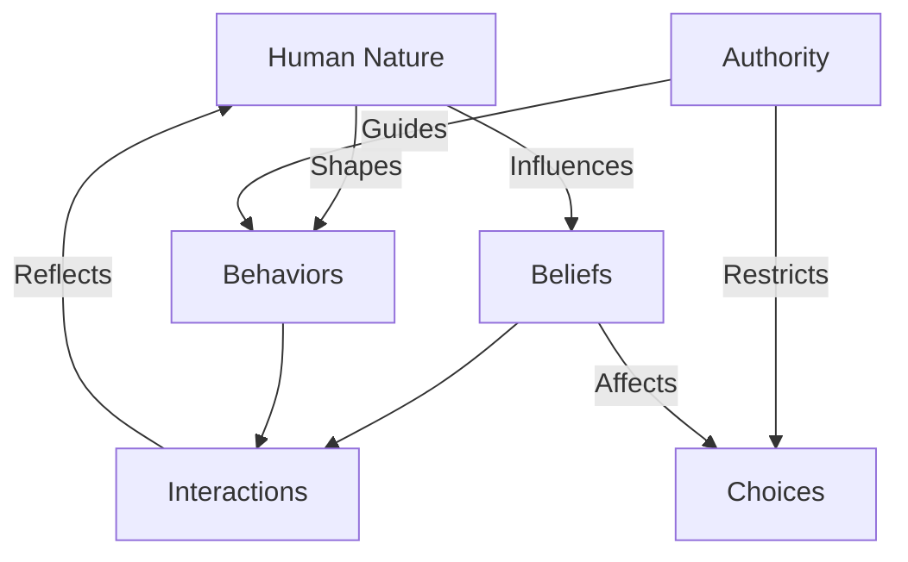

# [Influence and Authority](https://en.wikipedia.org/wiki/Social_influence)

- Based on past association, stereotyping, ideology, genetic influence, or direct experience, humans have a tendency to distort their thinking in favor of people or things that they like and against people or things they dislike. 
- This tendency leads to overrating the things we like and underrating or broadly categorizing things we dislike, often missing crucial nuances in the process.

!!! example "Examples of Influence and Authority"
    The CEO's authority in the company is unquestioned, but it's her ability to influence others' attitudes and beliefs that truly drives the organization forward.