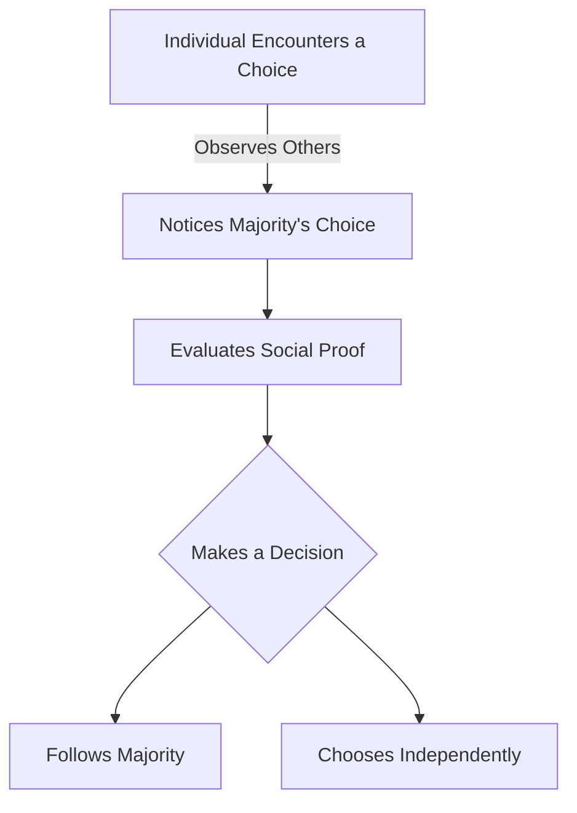

# [Social Proof](https://en.wikipedia.org/wiki/Social_proof)

- Human beings are one of many social species, along with bees, ants, and chimps, among many more. 
- We have a DNA-level instinct to seek safety in numbers and will look for social guidance of our behavior. 
- His instinct creates a cohesive sense of [cooperation](https://en.wikipedia.org/wiki/Cooperation) and culture which would not otherwise be possible, but also leads us to do foolish things if our group is doing them as well.

!!! example "Example of Social Proof"
    When John noticed that all his colleagues were switching to a new project management tool, he felt compelled to do the same, showcasing the power of social proof in influencing decisions.