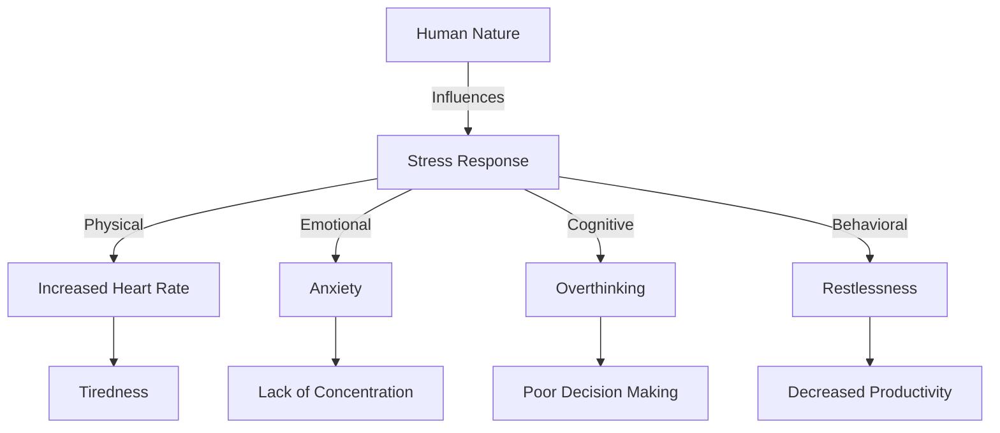

# [Stress](https://en.wikipedia.org/wiki/Stress_(biology))

- Stress causes both mental and physiological responses and tends to amplify the other biases. 
- Almost all human mental biases become worse in the face of stress as the body goes into a [fight-or-flight response](https://en.wikipedia.org/wiki/Fight-or-flight_response), relying purely on instinct without the emergency brake of [Daniel Kahneman](https://en.wikipedia.org/wiki/Daniel_Kahneman)’s “[System 2](https://en.wikipedia.org/wiki/Reasoning_system)” type of reasoning. 
- Stress causes hasty decisions, immediacy, and a fallback to habit, thus giving rise to the elite soldiers’ motto: “In the thick of battle, you will not rise to the level of your expectations, but fall to the level of your training.”

!!! example "Example of Stress"
    "I'm feeling incredibly overwhelmed by the amount of work I have to do by tomorrow."