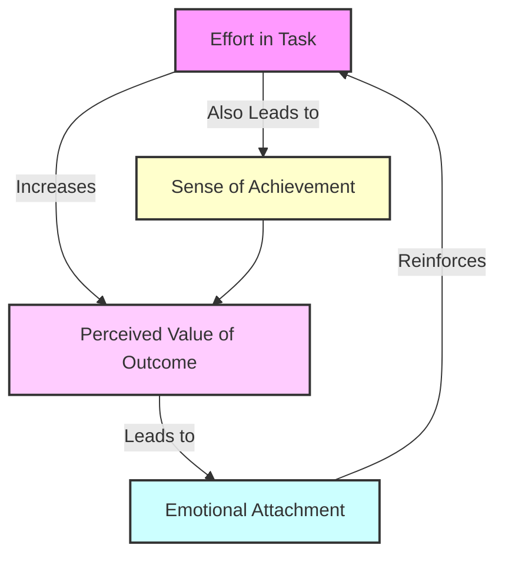

# [The Ikea Effect](https://en.wikipedia.org/wiki/IKEA)

- A [cognitive bias](https://en.wikipedia.org/wiki/Cognitive_bias) in which consumers place a disproportionately high value on products they partially created. The name derives from the name of Swedish manufacturer and furniture retailer IKEA, which sells many furniture products that require assembly.

- The IKEA effect has been described as follows: "The price is low for IKEA products largely because they take labor out of the equation. With a Phillips screwdriver, an Allen wrench and rubber mallet, IKEA customers can very literally build an entire home's worth of furniture on a very tight budget. But what happens when they do?" They "fall in love with their IKEA creations. Even when there are parts missing and the items are incorrectly built, customers in the IKEA study still loved the fruits of their labors."

!!! example "Example of the Ikea Effect"
    After spending hours assembling her new bookshelf, Maria felt a surprisingly strong sense of pride and attachment to it, a perfect demonstration of the Ikea effect.