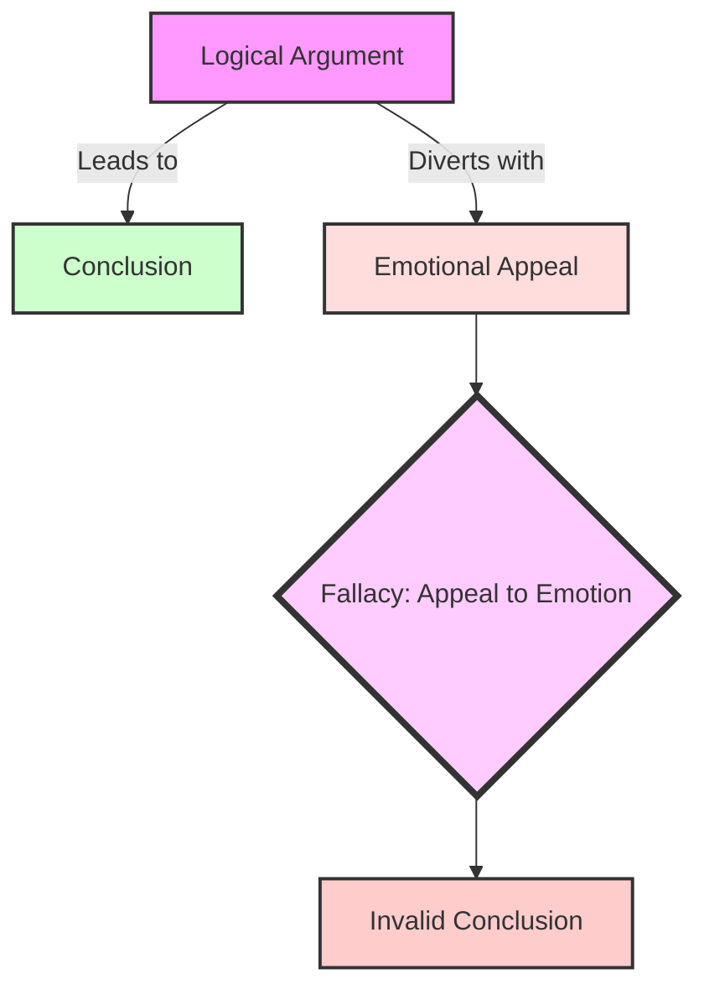

# [Appeal to Emotion](https://en.wikipedia.org/wiki/Appeal_to_emotion)

- Attempting to manipulate an [emotional](https://en.wikipedia.org/wiki/Emotion) response in place of a valid or compelling argument.
- Appeals to emotion include appeals to fear, envy, hatred, pity, pride, and more. 
- It's important to note that sometimes a logically coherent argument may inspire emotion or have an emotional aspect, but the problem and fallacy occurs when emotion is used instead of a logical argument, or to obscure the fact that no compelling rational reason exists for one's position. 
- Everyone, bar [sociopaths](https://en.wikipedia.org/wiki/Psychopathy#Sociopathy), is affected by emotion, and so appeals to emotion are a very common and effective argument tactic, but they're ultimately flawed, dishonest, and tend to make one's opponents justifiably emotional.

!!! example "Example of Appeal to Emotion"
    You must agree that our new policy is the best course of action, as anyone who cares about the welfare of our children would certainly support it.

