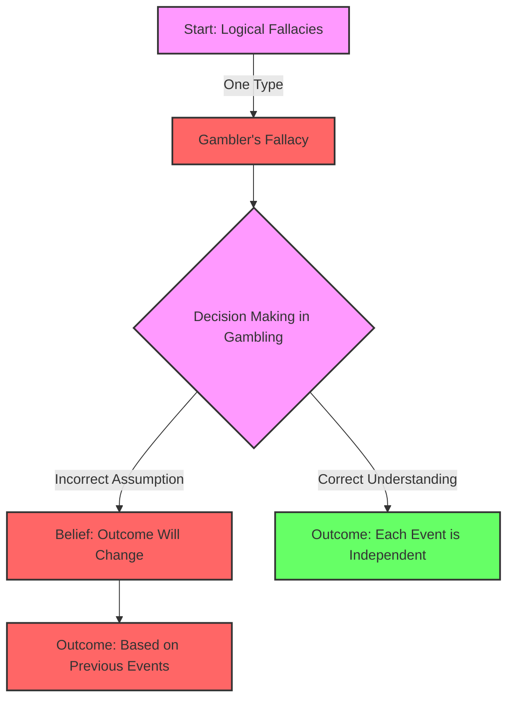

# [Gambler's Fallacy](https://en.wikipedia.org/wiki/Gambler%27s_fallacy)

- Saying that 'runs' occur to statistically independent phenomena such as [roulette](https://en.wikipedia.org/wiki/Roulette) wheel spins.

- This commonly believed fallacy can be said to have helped create an entire city in the desert of [Nevada](https://en.wikipedia.org/wiki/Nevada) USA. 

- Though the overall odds of a 'big run' happening may be low, each spin of the wheel is itself entirely independent from the last. 

While there may be a very small chance that heads will come up 20 times in a row if you flip a coin, the chances of heads coming up on each individual flip remain 50/50, and aren't influenced by what happened before.

!!! example "Example of Gamber's Fallacy"
    After the roulette ball landed on black ten times in a row, John was convinced that it had to land on red next time, demonstrating the gambler's fallacy.