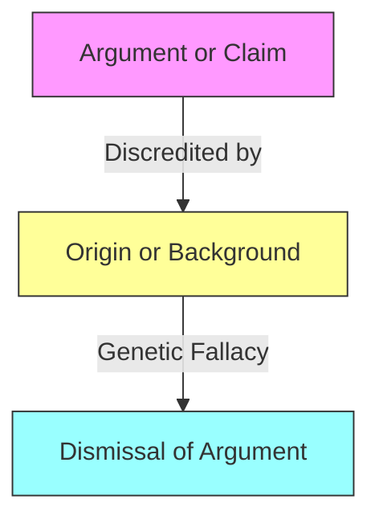

# [Genetic Fallacy](https://en.wikipedia.org/wiki/Genetic_fallacy)

- Judging something as either good or bad on the basis of where it comes from, or from whom it came.
This fallacy avoids the argument by shifting focus onto something's or someone's origins. 
- It's similar to an [ad hominem](https://en.wikipedia.org/wiki/Ad_hominem) fallacy in that it leverages existing negative perceptions to make someone's argument look bad, without actually presenting a case for why the argument itself lacks merit.

!!! example "Example of Genetic Fallacy"
    His arguments on environmental policy must be wrong because he used to be a lobbyist for oil companies.