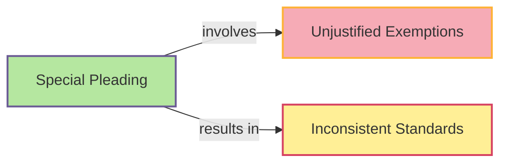

# [Special Plea](https://en.wikipedia.org/wiki/Special_pleading#:~:text=Special%20pleading%20is%20an%20informal,application%20of%20a%20double%20standard.)

- Moving the goalposts or made up an exception when your claim was shown to be false.

- Humans are funny creatures and have a foolish aversion to being wrong. 

- Rather than appreciate the benefits of being able to change one's mind through better understanding, many will invent ways to cling to old beliefs. 

- One of the most common ways that people do this is to post-rationalize a reason why what they thought to be true must remain to be true. 

- It's usually very easy to find a reason to believe something that suits us, and it requires integrity and genuine honesty with oneself to examine one's own beliefs and motivations without falling into the trap of justifying our existing ways of seeing ourselves and the world around us.

!!! example "Example of Special Pleading"
    Even though everyone was expected to abide by the deadline, John used special pleading to argue that he should be exempt due to his unique circumstances.

