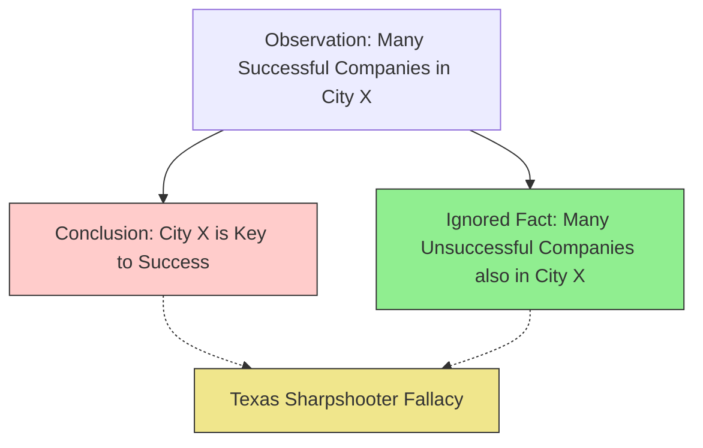

# [The Texas Sharpshooter](https://en.wikipedia.org/wiki/Texas_sharpshooter_fallacy)

- Cherry-picking a data cluster to suit your argument, or found a pattern to fit a [presumption](https://en.wikipedia.org/wiki/Presumption).
- This '[false cause](https://en.wikipedia.org/wiki/Questionable_cause)' fallacy is coined after a marksman shooting randomly at barns and then painting bullseye targets around the spot where the most bullet holes appear, making it appear as if he's a really good shot. 
- Clusters naturally appear by chance, but don't necessarily indicate that there is a [causal](https://en.wikipedia.org/wiki/Causality) relationship.

!!! example "Example of The Texas Sharpshooter"
    After noting that many of the successful companies were founded in the same city, the analyst concluded that the location was the key to success, ignoring the fact that many unsuccessful companies also started there